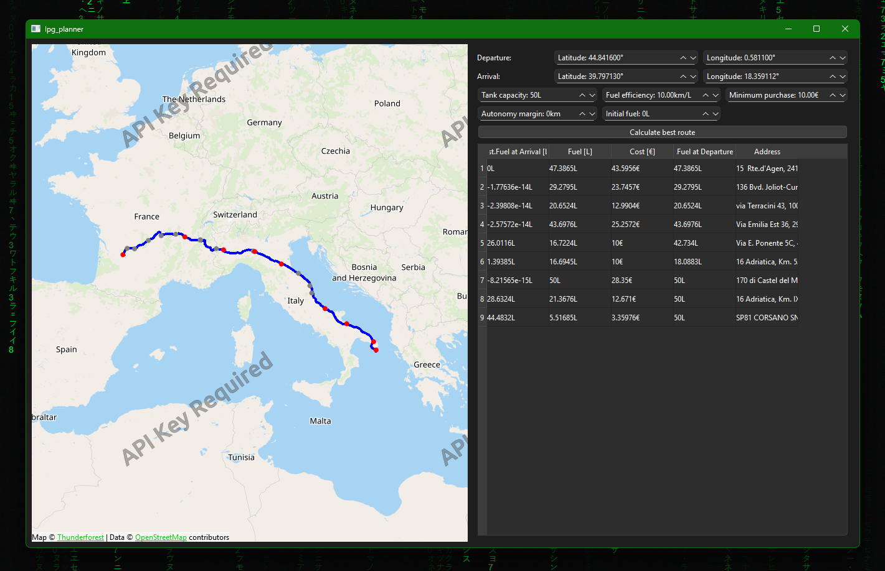

# Save money by planning ahead!

LPG is both a blessing and a curse. While there are both economic and ecologic benefits to it, the major (in my opinion!) issue is that fueling stations are sparse and prices vary wildly. When planning a road-trip, I often make use of apps and websites to find cheaper stations along the route, but... the longer the distance to drive, the harder it becomes to actually make a proper plan! :dizzy_face: And that's why I decided to create this simple app, whose objective is to calculate the optimal fueling strategy for each of my road-trips. Select departure and arrival, add you car information... and let the app do the rest!



:warning: The project is under active development, hopefully it will become functional and stable soon :sunglasses:


## Usage

:information_source: There is no release shipping pre-compiled binaries yet. As such, to use the app you should first compile the sources and setup the database - see below in this document.

The interface is pretty basic for now: on the left, a static map (user interaction will be added in future versions) that allows to visualize a planned roadtrip; on the right, the roadtrip settings and a details of the results.

First of all, choose a departure and arrival using the spinboxes. Then, adjust the following parameters:
- Tank capacity: how much LPG you car can store
- Fuel efficiency: distance that the car can drive with 1L of LPG
- Minimum Purchase: stops should be worth your time, you don't want to stop at each station for just 1€ of fuel... Note that this does not apply to the first and last stop - the reason being slightly technical, let's just say that it helps ensuring that we can find efficient routes!
- Autonomy margin: fuel efficiency is just an estimation - and in practice it is not even constant! - so it might be worth performing calculations with the objective of always having some fuel available in the tank. Not a big deal anyway, as all LPG cars can run with petrol as well and there is no risk of getting stuck somewhere :wink:
- Initial fuel: this is to take into account pre-existing LPG at the start of a trip!

Once you've chosen your settings, just click on "Calculate best route". The app will first ask OpenRouteService to find a route connecting the departure to the arrival, and the result will be shown in the map on the left (the solid blue line). The software will then query the stations database and retrieve all stations that are close to the driving path. The number of stations will then be reduced (quite drastically in fact) to select an appropriate amount of candidates. Finally, the proper optimization step will begin: the planner will apply the simplex method to solve a series of linear programming problems. After some (hopefully not too much!) thinking, the solution is displayed:
- In the table on the right, a list of stops shows how much fuel you are expected to pump and the related cost.
- In the map, red dots are added to show at which stations you will be stopping, while in grey you can see those that were discarded by the last optimization step (the map does not show all stations along the route, as it would not really add much information).

Happy planning!


## Building the App

### Dependencies

This project can be built using CMake, and has three dependencies: [Qt6](https://www.qt.io/product/qt6), [Eigen](https://libeigen.gitlab.io/) and [EigenOpt](https://github.com/francofusco/eigenopt).

My personal recommendation is to use [QtCreator](https://www.qt.io/product/development-tools) since it comes with CMake and Qt6. "Installing" Eigen and EigenOpt is quite simple: since they are both header-only libraries, you can go for the lazy option and just tell QtCreator (or whomever will build your project) where to find said headers. Or actually set them up using CMake so that they can be found system-wide. Your choice!

You will also need a python interpreter to run the configuration scripts. I recommend using a virtual environment to avoid polluting your system interpreter. Only standard packages should be required.


### Building the Sources

You should be able to compile the sources of LpgPlanner either from QtCreator or running the following in a terminal:

```
mkdir build
cd build
cmake ..
cmake --build .
```


## First-time Setup

After the app has been built, you still need to complete two steps:
1. Obtain an API key for OpenRouteService;
1. Initialize the local LPG database.


### OpenRouteService API key

Go to [OpenRouteService's website](https://openrouteservice.org/) and create an account. This will allow you to obtain an API key that you can use to perform distance queries. Note that with the free tier, the number of requests you can perform is technically limited, but unless you try to perform hundreds of plans every day, it should not be an issue. Once you created the account, copy the API key - it will be some long alpha-numeric string - and paste it *as the first line* in a plain text file named `open_route_service_api_key` (no extension! if there is one, just delete it). That's it!


### Setting up the Database

Open a console and move into the `scripts` folder, where there are few python scripts. Start by typing:

```
python create-database.py
```

As the command suggests, it should create a SQLite database (inside `AppData/Roaming/lpg_planner`) containing few tables. To add stations into the database, you can use the script `add-to-database.py`, which expects as input the path to a JSON file containing LPG stations data. The file should follow the following format:

```JSON
[
  {
    "address": { "street": "123 rue de la rue", "postal_code": "01234", "city": "Laville", "country": "This is optional"},
    "latitude": 45.454545,
    "longitude": 8.080808,
    "price": 0.999,
    "price_date": "31/12/2025"
  },
  ...
]
```

with one nested element per station. Note that:
- The `country` field in `address` is optional.
- The field `address` can be replaced with `address-compact`, assuming the latter contains a compact, string representation of the address, *e.g.*, `"123 rue de la rue, 01234, Laville, Nowhere"`.
- The date must be in `dd/mm/yyyy` format.

A helper script named `mylpg-pois-to-json.py` is also included, which allows to parse a list of points of interest generated using [myLPG.eu](https://www.mylpg.eu/lpg-station-route-planner/). To use the script, follow the procedure detailed in the web page, click on "Print Results" and save to a plain text file. Use the new file as input for the python script. **Please, do not abuse this to scrape data from the webpage**.


## Roadmap

A list of features to be implemented is tracked on GitHub, as [issues labelled as "todo"](https://github.com/francofusco/lpg-planner/issues?q=state%3Aopen%20label%3Atodo).


## Credits

Here is a list of resources found on the web and used in this project, with corresponding attributions:
- The project is based on [Qt6 for Open Source Development](https://www.qt.io/download-open-source).
- To show data on a map, we use [OpenStreetMap](openstreetmap.org/copyright) - via the OSM Qt plugin.
- For route calculations, we use: [© openrouteservice.org by HeiGIT | Map data © OpenStreetMap contributors](https://openrouteservice.org/)
- The gas station icons were derived from [Gas station icons created by nawicon - Flaticon](https://www.flaticon.com/free-icons/gas-station)
